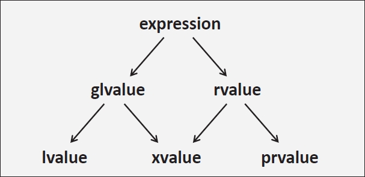

# Appendix B：值类别

表达式是 C++ 语言的基石，提供了表达计算的主要机制。每个表达式都有一个类型，该类型描述了其计算生成的值的静态类型。例如，表达式 `7` 的类型是 `int`，表达式 `5 + 2` 也是 `int` 类型，而如果 `x` 是 `int` 类型的变量，那么表达式 `x` 也属于 `int` 类型。**每个表达式还具有一个值类别，它描述了有关该值如何形成的一些信息，并影响表达式的行为。**

## B.1. 传统的 Lvalue 和 Rvalue

历史上，值类别只有两种：*lvalues* 和 *rvalues*。*lvalues* 是指那些引用实际存储在内存或机器寄存器中的值的表达式，例如 `x`，其中 `x` 是一个变量名。这些表达式可能是可修改的，允许更新存储的值。例如，如果 `x` 是一个 `int` 类型的变量，以下赋值语句将 `x` 的值替换为 `7`：

```cpp
x = 7;
```

术语 *lvalue* 源于这些表达式在赋值中的作用：字母“l”代表“左侧”（*left-hand side*），因为（在 C 语言的历史上）只有 *lvalues* 可以出现在赋值的左侧。相反，*rvalues*（“r”代表“右侧”，*right-hand side*）只能出现在赋值表达式的右侧。

然而，当 C 语言在 1989 年标准化时，情况发生了变化：虽然 `int const` 仍然是存储在内存中的一个值，但它不能出现在赋值的左侧：

```cpp
int const x;    // x 是一个不可修改的 lvalue
x = 7;          // 错误：左侧需要一个可修改的 lvalue
```

C++ 进一步改变了这一点：类 *rvalues* 也可以出现在赋值的左侧。**这类赋值实际上是对类的适当赋值操作符的函数调用，而不是对标量类型的“简单”赋值，因此它们遵循成员函数调用的（独立）规则。**

由于这些变化，*lvalue* 这一术语现在有时被解释为“可定位的值”（*localizable value*）。指向变量的表达式并不是唯一一种 *lvalue* 表达式。另一类 *lvalue* 表达式包括指针解引用操作（例如 `*p`），它指向指针引用的地址处存储的值，以及指向类对象成员的表达式（例如 `p->data`）。甚至返回传统 *lvalue* 引用类型（用 `&` 声明）的函数调用也是 *lvalues*。例如：

```cpp
std::vector<int> v;
v.front(); // 返回一个 lvalue，因为返回类型是 lvalue 引用
```

或许令人惊讶的是，字符串字面量也是（不可修改的）*lvalues*。

*rvalues* 是纯数学值（例如 `7` 或字符 `'a'`），它们不一定有任何关联的存储空间；它们在计算过程中被创建，但一旦使用过后就无法再引用。特别是，除字符串字面量外的任何字面值（例如 `7`、`'a'`、`true`、`nullptr`）都是 *rvalues*，许多内置算术计算的结果（例如 `x + 5`，其中 `x` 是整数类型）和返回值的函数调用也是 *rvalues*。也就是说，所有临时对象都是 *rvalues*。（但这不适用于引用它们的命名引用。）

### B.1.1. *lvalue* 到 *rvalue* 的转换

由于 *rvalues* 的短暂性，它们在“简单”赋值的右侧受到限制：例如，赋值语句 `7 = 8` 毫无意义，因为数学上的 `7` 无法重新定义。而 lvalues 则没有这种限制：当 `x` 和 `y` 是兼容类型的变量时，计算赋值 `x = y` 是完全合理的，尽管 `x` 和 `y` 都是 lvalues。

赋值 `x = y` 之所以有效，是因为右侧的表达式 `y` 经过了一种称为 *lvalue* 到 *rvalue* 转换的隐式转换。顾名思义，*lvalue* 到 *rvalue* 的转换会将一个 *lvalue* 转换为相同类型的 *rvalue*，通过从与该 *lvalue* 关联的存储或寄存器中读取值来实现。这种转换实现了两个目的：首先，它确保 *lvalue* 可以在需要 *rvalue* 的地方使用（例如，在赋值的右侧或数学表达式 `x + y` 中）。其次，它标识了程序中的何处（在优化之前）编译器可以发出“加载”指令从内存中读取值。

## B.2. 自 C++11 以来的值类别

当 C++11 引入右值引用以支持移动语义时，传统的 *lvalue* 和 *rvalue* 的划分已经不足以描述所有 C++11 的语言行为。因此，C++ 标准化委员会基于三种核心类别和两种复合类别重新设计了值类别系统（参见图 B.1）。核心类别是：*lvalue*、*prvalue*（“纯 *rvalue*”）和 *xvalue*。复合类别是：*glvalue*（“广义 *lvalue*”，是 *lvalue* 和 *xvalue* 的并集）和 *rvalue*（*xvalue* 和 *prvalue* 的并集）。

请注意，所有表达式仍然是 *lvalues* 或 *rvalues*，但 *rvalues* 类别现在进一步细分。

<center>
图 B.1 C++11 开始的值类别
</center>
<div align="center">
    
</div>

C++11 引入的值类别分类一直沿用至今，但在 C++17 中，对这些类别的定义进行了如下重新表述：

- **glvalue**：是一种表达式，其表达式计算确定一个对象、位域或函数的标识（即一个具有存储空间的实体）。
- **prvalue**：是一种表达式，其表达式计算用于初始化一个对象或位域，或计算运算符的操作数的值。
- **xvalue**：是一种 *glvalue*，指示的对象或位域的资源可以被重用（通常是因为它即将“过期”——*xvalue* 中的“x”最初来自“*eXpiring value*”）。
- **lvalue**：是一种 *glvalue*，但不是 *xvalue*。
- **rvalue**：是一种 *prvalue* 或 *xvalue*。

需要注意的是，在 C++17（以及在某种程度上，C++11 和 C++14）中，*glvalue* 与 *prvalue* 的二分法可以说比传统的 *lvalue* 与 *rvalue* 区分更为根本。虽然这是 C++17 引入的描述，但这些描述同样适用于 C++11 和 C++14（之前的描述等效，但更难推理）。

除了位域外，*glvalue* 会产生具有地址的实体。该地址可能是一个更大封闭对象的子对象的地址。如果是基类子对象，*glvalue* 的类型（表达式）称为其静态类型，而该基类所属的最派生对象的类型称为 *glvalue* 的动态类型。如果 *glvalue* 不产生基类子对象，那么其静态类型和动态类型是相同的（即表达式的类型）。

以下是 *lvalue* 的一些示例：
- 指定变量或函数的表达式
- 内置一元 `*` 操作符的应用（“指针间接”）
- 仅为字符串字面量的表达式
- 返回类型为 *lvalue* 引用的函数调用

以下是 *prvalue* 的一些示例：
- 由非字符串字面量或用户定义字面量组成的表达式[^1]
- 内置一元 `&` 操作符的应用（即获取表达式的地址）
- 内置算术操作符的应用
- 返回类型不是引用类型的函数调用
- Lambda 表达式

以下是 *xvalue* 的一些示例：
- 返回类型为对象类型的 *rvalue* 引用的函数调用（例如 `std::move()`）
- 对对象类型的 *rvalue* 引用的强制类型转换

需要注意的是，函数类型的 *rvalue* 引用会生成 *lvalue*，而不是 *xvalue*。

值得强调的是，*glvalue*、*prvalue*、*xvalue* 等都是表达式，而不是值或实体[^2]。例如，变量不是 *lvalue*，尽管表示变量的表达式是 *lvalue*：

```cpp
int x = 3;  // 这里的 x 是变量，而不是 lvalue。3 是一个 prvalue，用于初始化变量 x。
int y = x;  // 这里的 x 是 lvalue。对该 lvalue 表达式的求值不会产生值 3，而是指向包含值 3 的对象。
            // 然后该 lvalue 被转换为 prvalue，用于初始化 y。
```

### B.2.1. 临时对象的实体化

我们之前提到，*lvalue* 通常会经历 *lvalue* 到 *rvalue* 的转换[^3]，因为 *prvalue* 是用于初始化对象的表达式（或为大多数内置操作符提供操作数的表达式）。

在 C++17 中，这种转换有一个对应的过程，称为**临时对象的实体化**（但它也可以称为“*prvalue* 到 *xvalue* 的转换”）：每当 *prvalue* 在需要 *glvalue*（包括 *xvalue* 的情况）的位置出现时，就会创建并使用 *prvalue* 初始化一个临时对象（回忆一下，*prvalue* 主要是“初始化值”），然后将该 *prvalue* 替换为指向临时对象的 *xvalue*。例如：

```cpp
int f(int const&);
int r = f(3);
```

在这个例子中，`f()` 有一个引用参数，因此它期望一个 *glvalue* 作为参数。然而，表达式 `3` 是一个 *prvalue*。因此，“临时对象的实体化”规则启动，表达式 `3` 被“转换”为指向一个初始化为值 `3` 的临时对象的 *xvalue*。

更广泛地说，临时对象在以下情况中被实体化以便与 *prvalue* 初始化：

- *prvalue* 绑定到一个引用（例如上述 `f(3)` 的调用）；
- 访问类 *prvalue* 的成员；
- 数组 *prvalue* 被下标访问；
- 数组 *prvalue* 被转换为指向其第一个元素的指针（即数组衰减）；
- *prvalue* 出现在用于某类型 `X` 初始化 `std::initializer_list<X>` 对象的大括号初始化列表中；
- 对 *prvalue* 应用 `sizeof` 或 `typeid` 操作符；
- *prvalue* 是形如 `expr;` 的语句中的顶级表达式，或表达式被强制转换为 `void`；

因此，在 C++17 中，*prvalue* 初始化的对象总是由上下文决定的，结果是，仅在真正需要时才会创建临时对象。在 C++17 之前，*prvalue*（特别是类类型的 *prvalue*）总是暗示着一个临时对象。这些临时对象的副本可能在之后被省略，但编译器仍然必须强制执行复制操作的大多数语义约束（例如，可能需要调用复制构造函数）。以下示例展示了 C++17 规则修订的一个后果：

```cpp
class N {
public:
    N();
    N(N const&) = delete;   // 此类既不可复制...
    N(N&&) = delete;        // ... 也不可移动
};
N make_N() {
    return N{};     // 在 C++17 之前，总会创建一个概念上的临时对象。
}                   // 在 C++17 中，此时不创建临时对象。
auto n = make_N();  // 在 C++17 之前会报错，因为 prvalue 需要一个概念上的复制。
                    // 在 C++17 中是 OK 的，因为 n 是直接从 prvalue 初始化的。
```

在 C++17 之前，`N` 的 *prvalue* 会产生一个类型为 `N` 的临时对象，但编译器被允许省略该临时对象的复制和移动（实际上他们总是这样做）。在这种情况下，这意味着 `make_N()` 调用的临时结果可以直接在 `n` 的存储空间中构造；不需要任何复制或移动操作。不幸的是，C++17 之前的编译器仍然必须检查是否可以进行复制或移动操作，而在这个例子中这是不可能的，因为 `N` 的复制构造函数被删除了（且没有生成移动构造函数）。因此，C++11 和 C++14 编译器必须为此示例发出错误。

在 C++17 中，`N` 的 *prvalue* 本身不产生临时对象。相反，它初始化了一个由上下文决定的对象：在我们的示例中，该对象是 `n` 所表示的对象。不会考虑任何复制或移动操作（这不是优化，而是语言保证），因此代码在 C++17 中是合法的。

我们最后用一个展示各种值类别情况的示例来总结：

```cpp
class X {
};
X v;
X const c;
void f(X const&);   // 接受任何值类别的表达式
void f(X&&);        // 仅接受 prvalue 和 xvalue，但比之前的声明更适合这些情况
f(v);               // 将一个可修改的 lvalue 传递给第一个 f()
f(c);               // 将一个不可修改的 lvalue 传递给第一个 f()
f(X());             // 将一个 prvalue（自 C++17 起实体化为 xvalue）传递给第二个 f()
f(std::move(v));    // 将一个 xvalue 传递给第二个 f()
```

[^1]: 用户定义的字面量可能会生成 *lvalues* 或 *rvalues*，这取决于关联的字面量运算符的返回类型。
[^2]: 这不幸地意味着这些术语是不准确的。
[^3]: 在 C++11 的值类别中，术语“*glvalue* 到 *prvalue* 的转换”会更准确，但传统术语仍然更为常用。

## B.3. 使用 `decltype` 检查值类别

通过 C++11 引入的关键字 `decltype`，可以检查任何 C++ 表达式的值类别。对于任何表达式 `x`，`decltype((x))`（注意双括号）返回：
- 如果 `x` 是一个 *prvalue*，则返回 `type`。
- 如果 `x` 是一个 *lvalue*，则返回 `type&`。
- 如果 `x` 是一个 *xvalue*，则返回 `type&&`。

`decltype((x))` 中的双括号是必要的，以避免在表达式 `x` 确实命名一个实体的情况下生成该命名实体的声明类型（在其他情况下，括号没有效果）。例如，如果表达式 `x` 只是命名一个变量 `v`，那么不带括号的构造变成 `decltype(v)`，这会产生变量 `v` 的类型，而不是反映引用该变量的表达式 `x` 的值类别的类型。

因此，使用类型特征检查任何表达式 `e` 的值类别，可以如下进行：

```cpp
if constexpr (std::is_lvalue_reference<decltype((e))>::value) {
    std::cout << "expression is lvalue\n";
}
else if constexpr (std::is_rvalue_reference<decltype((e))>::value) {
    std::cout << "expression is xvalue\n";
}
else {
    std::cout << "expression is prvalue\n";
}
```

详见第 15.10.2 节。

## B.4. 引用类型

C++ 中的引用类型——如 `int&`——以两种重要方式与值类别相互作用。第一种方式是引用可以限制其可以绑定的表达式的值类别。例如，类型为 `int&` 的非 *const lvalue* 引用只能通过类型为 `int` 的 lvalue 初始化。同样，类型为 `int&&` 的 *rvalue* 引用只能通过类型为 `int` 的 *rvalue* 初始化。

第二种方式是引用类型的返回类型影响调用该函数时的值类别。特别地：
- 返回类型为 *lvalue* 引用的函数调用返回 *lvalue*；
- 返回类型为对象类型的 *rvalue* 引用的函数调用返回 *xvalue*（函数类型的 *rvalue* 引用总是返回 *lvalues*）；
- 返回非引用类型的函数调用返回 *prvalue*；

我们在以下示例中说明了引用类型与值类别之间的相互作用。给定：

```cpp
int& lvalue();
int&& xvalue();
int prvalue();
```

可以通过 `decltype` 确定给定表达式的**值类别**和**类型**。如第 15.10.2 节所述，它使用引用类型来描述表达式是 *lvalue* 还是 *xvalue*：

```cpp
std::is_same_v<decltype(lvalue()), int&>    // 返回 true，因为结果是 lvalue
std::is_same_v<decltype(xvalue()), int&&>   // 返回 true，因为结果是 xvalue
std::is_same_v<decltype(prvalue()), int>    // 返回 true，因为结果是 prvalue
```

因此，以下调用是可能的：

```cpp
int& lref1 = lvalue();      // OK: lvalue 引用可以绑定到 lvalue
int& lref3 = prvalue();     // ERROR: lvalue 引用不能绑定到 prvalue
int& lref2 = xvalue();      // ERROR: lvalue 引用不能绑定到 xvalue
int&& rref1 = lvalue();     // ERROR: rvalue 引用不能绑定到 lvalue
int&& rref2 = prvalue();    // OK: rvalue 引用可以绑定到 prvalue
int&& rref3 = xvalue();     // OK: rvalue 引用可以绑定到 xvalue
```