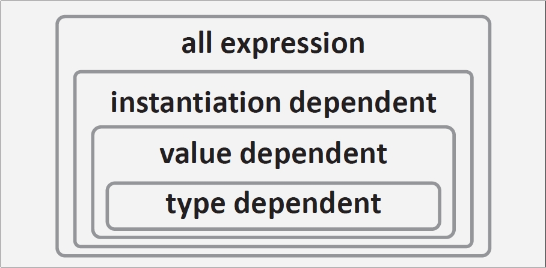

# 13. 模板名称

名称是大多数编程语言中的基本概念。它们是程序员用于引用先前构建的实体的方式。当C++编译器遇到一个名称时，必须“查找”它以确定引用的实体。从实现者的角度来看，C++ 在这方面是一个难度较大的语言。考虑 C++ 语句 `x*y;`。如果 `x` 和 `y` 是变量名，这个语句表示乘法操作；但如果 `x` 是一个类型名，那么该语句则声明了一个指向类型 `x` 的指针 `y`。

这个小例子说明了 C++（与C一样）是一个上下文敏感的语言：一个结构如果没有更广泛的上下文是无法理解的。这与模板有何关系？模板是必须处理多个更广泛上下文的结构：1、模板出现的上下文；2、模板实例化的上下文；以及，3、与实例化模板所用模板参数相关的上下文。因此，C++中对 “名称” 需要非常小心地处理，这并不令人完全意外。

## 13.1 名称分类

C++ 以多种方式对名称进行分类 —— 事实上是非常多的分类。为了帮助理解这些丰富的术语，我们提供了表 13.1 来描述这些分类。幸运的是，通过熟悉两个主要的命名概念，你可以对大多数 C++ 模板问题获得良好的理解：

1. 如果一个名称的所属作用域通过作用域解析操作符 `::` 或成员访问操作符（`.`或`->`）明确表示，则该名称为**限定名称**。例如，`this->count`是一个限定名称，而 `count` 则不是（即使单独的 `count` 实际上可能引用一个类成员）。

2. 如果一个名称在某种程度上依赖于模板参数，则称之为**依赖名称**。例如，如果 `T` 是一个模板参数，则 `std::vector<T>::iterator` 通常是一个依赖名称，但如果 `T` 是已知类型别名（例如 `using T = int` 中的 `T`），则它是非依赖名称。

<center>
表 13.1 名称分类（Name Taxonomy）
</center>
<table><thead>
  <tr>
    <th>分类</th>
    <th>解释和标注</th>
  </tr></thead>
<tbody>
  <tr>
    <td>标识符（Identifier）</td>
    <td>由字母、下划线（_）和数字组成的连续字符序列，不能以数字开头。部分标识符保留供实现使用：在编程时不应引入它们（通常避免使用前置下划线和双下划线）。“字母”应广义理解，包含非字母语言的通用字符名称（UCNs）。</td>
  </tr>
  <tr>
    <td>运算符函数标识符（Operator-function-id）</td>
    <td>由关键字 <mark>operator</mark> 后接运算符符号组成，例如 <mark>operator new</mark> 和 <mark>operator []</mark>。</td>
  </tr>
  <tr>
    <td>转换函数标识符（Conversion-function-id）</td>
    <td>用于表示用户定义的隐式转换运算符，例如 <mark>operator int&</mark>，也可写作 <mark>operator int bitand</mark>。</td>
  </tr>
  <tr>
    <td>字面量运算符标识符（Literal-operator-id）</td>
    <td>用于表示用户定义的字面量运算符，例如<mark>operator ""_km</mark>，用于字面量如<mark>100_km</mark>（C++11引入）。</td>
  </tr>
  <tr>
    <td>模板标识符（Template-id）</td>
    <td>模板名称后跟用尖括号括起来的模板参数；例如<mark>List<T, int, 0></mark>。模板标识符还可以是运算符函数标识符或字面量运算符标识符，后接模板参数；例如<mark>operator+<X<int>></mark>。</td>
  </tr>
  <tr>
    <td>非限定标识符（Unqualified-id）</td>
    <td>标识符的广义化。可以是上述任何一种（标识符、运算符函数标识符、转换函数标识符、字面量运算符标识符或模板标识符），也可以是“析构函数名称”（例如 <mark>~Data</mark> 或 <mark>~List<T, T, N></mark>）。</td>
  </tr>
  <tr>
    <td>限定标识符（Qualified-id）</td>
    <td>带有类、枚举或命名空间名称限定的非限定标识符，或仅用全局作用域解析操作符限定。此名称本身可以是限定的。示例有<mark>::X</mark>、<mark>S::x</mark>、<mark>Array<T>::y</mark>和 <mark>::N::A<T>::z</mark>。</td>
  </tr>
  <tr>
    <td>限定名称（Qualified name）</td>
    <td>该术语未在标准中定义，但用于指需要限定查找的名称。具体来说，它是限定标识符或用显式成员访问操作符（.或->）后的非限定标识符。例如 <mark>S::x</mark>、<mark>this->f</mark> 和 <mark>p->A::m</mark>。然而，在上下文中等同于 <mark>this->class_mem</mark> 的 <mark>class_mem</mark> 不是限定名称：成员访问必须是显式的。</td>
  </tr>
  <tr>
    <td>非限定名称（Unqualified name）</td>
    <td>非限定标识符，但不是限定名称。这不是标准术语，对应于标准中称为非限定查找的名称。</td>
  </tr>
  <tr>
    <td>名称（Name）</td>
    <td>可以是限定名称或非限定名称。</td>
  </tr>
  <tr>
    <td>依赖名称（Dependent name）</td>
    <td>一种在某种程度上依赖模板参数的名称。通常，显式包含模板参数的限定或非限定名称即为依赖名称。此外，若由成员访问操作符（<mark>.</mark>或<mark>-></mark>）限定的名称的左侧表达式类型依赖于模板参数（此概念将在第 13.3.6 节讨论），则该名称通常是依赖名称。例如，在模板中 <mark>this->b</mark> 中的 <mark>b</mark> 通常为依赖名称。最后，若名称受参数依赖查找影响（详见第13.2节），如在 <mark>ident(x, y)</mark> 形式的调用中的 <mark>ident</mark>，或表达式 <mark>x + y</mark>中的 <mark>+</mark>，则当且仅当其中一个参数表达式为类型依赖时，该名称为依赖名称。</td>
  </tr>
  <tr>
    <td>非依赖名称（Nondependent name）</td>
    <td>根据上述描述，不是依赖名称的名称即为非依赖名称。</td>
  </tr>
</tbody>
</table>

建议浏览这些术语表以熟悉在描述 C++ 模板问题时常用的术语，但不必记住每个术语的确切含义。如有需要，可轻松在索引中查找。

## 13.2 查找名称

在 C++ 中，查找名称涉及许多小细节，但我们将重点关注几个主要概念。这些细节旨在确保：1、正常情况可以直观处理；2、异常情况也能够被标准涵盖。

限定名称（Qualified names）是在限定构造所暗示的作用域中进行查找的。**如果该作用域是一个类，那么基类的成员也可能会被搜索**。然而，查找限定名称时不会考虑封闭的外部作用域。以下代码示例演示了这一基本原则：

```cpp
int x;

class B {
public:
    int i;
};

class D : public B {
};

void f(D* pd)
{
    pd->i = 3;  // 找到 B::i
    D::x = 2;   // 错误：在封闭作用域中找不到 ::x
}
```

相对而言，非限定名称（Unqualified names）通常会依次在更封闭的作用域中进行查找（尽管在成员函数定义中，会首先在类及其基类的作用域中查找）。这种查找方式称为普通查找（ordinary lookup）。以下是普通查找的基本示例：

```cpp
extern int count;               // #1
int lookup_example(int count)   // #2
{
    if (count < 0) {
        int count = 1;          // #3
        lookup_example(count);  // 非限定的 count 指向 #3
    }
    return count + ::count;     // 第一个（非限定）count 指向 #2；第二个（限定）count 指向 #1
}
```

最近的非限定名称查找新变化之一是 —— 除了普通查找外，有时还可能触发参数依赖查找（Argument-Dependent Lookup, ADL）[1]。在进入 ADL 的细节之前，我们通过经典的 `max()` 模板示例来说明这一机制：

```cpp
template<typename T>
T max (T a, T b)
{
    return b < a ? a : b;
}
```

假设现在我们需要将此模板应用于另一个命名空间中定义的类型：

```cpp
namespace BigMath {
    class BigNumber {
        ...
    };
    bool operator < (BigNumber const&, BigNumber const&);
    ...
}

using BigMath::BigNumber;
void g (BigNumber const& a, BigNumber const& b)
{
    ...
    BigNumber x = ::max(a, b);
    ...
}
```

问题在于 `max()` 模板不了解 `BigMath` 命名空间，而普通查找不会找到适用于 `BigNumber` 类型的 `operator <`。如果没有一些特殊规则，这会在 C++ 命名空间中大大减少模板的适用性。ADL 是 C++ 针对这些特殊规则的解决方案。

### 13.2.1 参数依赖查找 (Argument-Dependent Lookup, ADL)

ADL（参数依赖查找）主要适用于在函数调用或操作符调用中看起来像**非成员函数的非限定名称**。若普通查找发现了以下情况，ADL 不会被触发：

- 成员函数的名称，
- 变量的名称，
- 类型的名称，或
- 块作用域内的函数声明名称。

如果要调用的函数名称被括号包围，ADL 也不会执行。否则，当名称后面有一组参数表达式时，ADL会在与调用参数类型“关联”的命名空间和类中查找该名称。稍后将给出这些关联命名空间和类的精确定义，但直观来看，它们可以被理解为**与给定类型直接相关的所有命名空间和类**。例如，如果类型是指向类 X 的指针，那么关联的类和命名空间将包括 X 以及 X 所属的任何命名空间或类。

关联命名空间和类的精确定义规则如下：

- 对于内建类型，关联集为空。
- 对于指针和数组类型，关联命名空间和类集是底层类型的关联集。
- 对于枚举类型，关联命名空间是声明该枚举的命名空间。
- 对于类成员，封闭类是关联类。
- 对于类类型（包括联合类型），关联类的集合包括该类型本身、封闭类以及所有直接和间接基类。关联命名空间的集合是声明关联类的命名空间。如果该类是类模板实例，还包括模板类型参数的类型以及模板模板参数声明所在的类和命名空间。
- 对于函数类型，关联的命名空间和类包括所有参数类型和返回类型的关联命名空间和类。
- 对于指向类 X 的成员的指针类型，关联命名空间和类集合包括 X 的关联集合以及成员的类型关联集合（如果是指向成员函数的指针类型，参数和返回类型也会有所贡献）。

然后，ADL会在所有关联命名空间中查找该名称，仿佛该名称依次在这些命名空间中被限定一样，但忽略 `using` 指令。以下示例演示了这一过程：[adl.cpp](../../Codes/ch13/13_2/adl.cpp)

```cpp
#include <iostream>

namespace X
{
    template<typename T> void f(T);
} // namespace X

namespace N {
    using namespace X;
    enum E { e1 };
    void f(E) {
        std::cout << "N::f(N::E) called\n";
    }
}

void f(int) {
    std::cout << "::f(int) called\n";
}

int main()
{
    ::f(N::e1); // 限定函数名：没有 ADL
    f(N::e1);   // 普通查找到：::f() 和 ADL 查找到 N::f()，
                // 后面一个查找最为匹配
}
```

请注意，在该示例中，ADL 执行时忽略了命名空间 `N` 中的 `using` 指令。因此，`main()` 中的调用不会将 `X::f()` 视为候选。

### 13.2.2 友元 ADL

一个友元函数声明可以是所提名函数的第一个声明。如果是这种情况，则假定该函数是在包含友元声明的类所包围的最近命名空间作用域（这可能是全局作用域）中声明的。然而，这样的友元声明在该作用域中并不直接可见。考虑以下示例：

```cpp
template<typename T>
class C {
    ...
    friend void f();
    friend void f(C<T> const&);
    ...
};

void g(C<int>* p) {
    f(); // 这里 f() 可见吗？
    f(*p); // 这里 f(C<int> const&) 可见吗？
}
```

如果友元声明在封闭的命名空间中可见，那么类模板的实例化可能会使普通函数的声明可见。这将导致令人惊讶的行为：除非程序中较早出现类 C 的实例化，否则调用 `f()` 会导致编译错误！

另一方面，在友元声明中仅声明（并定义）一个函数是有用的（参见第 21.2.1 节，了解依赖于此行为的技术）。当类是 ADL（参数依赖查找）所考虑的关联类之一时，这样的函数可以被找到。

重新考虑我们最后的示例。调用 `f()` 没有任何关联类或命名空间，因为没有参数：在我们的示例中，它是一个无效的调用。然而，调用 `f(*p)` 确实有关联的类 `C<int>`（因为这是 `*p` 的类型），全局命名空间也与之关联（因为这是 `*p` 类型声明所在的命名空间）。因此，第二个友元函数声明可以被找到，前提是 `C<int>` 类在调用之前已经完全实例化。为了确保这一点，假设涉及查找友元的调用会导致类实例化（如果尚未实例化的话）[2]。

参数依赖查找（ADL）能够找到友元声明和定义的能力有时被称为“友元名称注入”。然而，这个术语有些误导，因为它指的是一个标准前的 C++ 特性，确实“注入”了友元声明的名称到封闭作用域中，使它们对正常的名称查找可见。在我们上面的示例中，这将意味着两个调用都会是合法的。本章的附录进一步详细介绍了友元名称注入的历史。

### 13.2.3 注入的类名

类的名称会被注入到该类自身的作用域内，因此在该作用域内可以作为非限定名称访问。（然而，它不能作为限定名称访问，因为限定名称用于表示构造函数）。例如：[inject.cpp](../../Codes/ch13/13_2/inject.cpp)

```cpp
#include <iostream>

int C;

class C
{
private:
    int i[2];

public:
    static int f()
    {
        return sizeof(C);
    }
};

int f()
{
    return sizeof(C);
}

int main()
{
    std::cout << "C::f() = " << C::f() << ','
              << " ::f() = " << ::f() << '\n';
}
```

在 `C::f()` 成员函数中，返回的是类型 `C` 的大小；而在函数 `::f()` 中，返回的是变量 `C` 的大小（换句话说，是 `int` 对象的大小）。

类模板同样具有注入类名。然而，这些注入类名比普通的注入类名更复杂：它们可以后接模板参数（此时被称为注入的类模板名），但如果不接模板参数，它们会在上下文需要一个类型时表示类及其参数（或部分特化时的特化参数），在上下文需要模板时表示模板。这可以解释以下情况：

```cpp
template<template<typename> class TT> class X {
};
template<typename T> class C {
    C* a;       // OK：等价于 "C<T>* a;"
    C<void>& b; // OK
    X<C> c;     // OK：未带模板参数列表的 C 表示模板 C
    X<::C> d;   // OK：::C 不是注入类名，因此始终表示模板
};
```

请注意，未限定名称会引用注入的名称，而不会被视为模板的名称，除非后接模板参数列表。为此，可以使用文件作用域限定符 `::` 强制找到模板的名称。

对于可变参数模板，注入类名有额外的复杂性：如果直接通过使用可变参数模板的模板参数形成注入类名，注入类名中会包含未展开的模板参数包（有关参数包展开的详细信息，请参阅第 12.4.1 节）。因此，在为可变参数模板形成注入类名时，对应于模板参数包的模板参数会通过参数包展开来形成，其模式为该模板参数包：

```cpp
template<int I, typename... T> class V {
    V* a;         // OK：等价于 "V<I, T...>* a;"
    V<0, void> b; // OK
};
```

### 13.2.4 当前实例化

类或类模板的注入类名实际上是被定义类型的别名。对于非模板类，这个特性显而易见，因为类本身是该名称和作用域中唯一的类型。然而，在类模板或类模板中的嵌套类中，每个模板实例化都会生成不同的类型。这一特性在该上下文中特别有趣，因为**注入类名指的是类模板的当前实例化，而不是该类模板的其他特化**（嵌套类中的情况也一样）。

在类模板中，注入类名或等价于注入类名的任何类型（包括通过类型别名声明）都被认为引用当前实例化。而依赖于模板参数的类型（即依赖类型）但不引用当前实例化的类型被认为是未知特化，可能是从相同类模板实例化的，也可能是完全不同的类模板实例化的。例如：

```cpp
template<typename T> class Node {
    using Type = T;
    Node* next;           // Node 引用当前实例化
    Node<Type>* previous; // Node<Type> 引用当前实例化
    Node<T*>* parent;     // Node<T*> 引用未知特化
};
```

在嵌套类和类模板的情况下，识别一个类型是否引用当前实例化可能会很复杂。外部类或类模板的注入类名（或等价类型）确实引用当前实例化，而其他嵌套类或类模板的名称则不会：

```cpp
template<typename T> class C {
    using Type = T;
    struct I {
        C* c;         // C 引用当前实例化
        C<Type>* c2;  // C<Type> 引用当前实例化
        I* i;         // I 引用当前实例化
    };
    struct J {
        C* c;         // C 引用当前实例化
        C<Type>* c2;  // C<Type> 引用当前实例化
        I* i;         // I 引用未知特化，因为 I 不包含 J
        J* j;         // J 引用当前实例化
    };
};
```

当类型引用当前实例化时，被实例化的类的内容保证是从当前定义的类模板或嵌套类中实例化的。这对解析模板时的名称查找有影响，同时也提供了一种更直观的方式来判断类模板定义中的类型 `X` 是否引用当前实例化或未知特化：如果可以通过显式特化（详见第 16 章）使 `X` 引用该特化，那么 `X` 引用未知特化。例如：

```cpp
template<> struct C<int>::I {
  // 特例化的定义
};
```

在此示例中，`C<int>::I` 的特化提供了一个与 `C<T>::J` 定义中可见的定义完全不同的定义，因此 `C<T>::J` 定义中的 `I` 引用未知特化。

## 13.3 解析模板

编译器对于大多数编程语言的两个基本任务是**标记化**（也称为扫描或词法分析）和**解析**。标记化过程将源代码作为字符序列读取，并从中生成一系列的**标记**。例如，在看到字符序列 `int* p = 0;` 时，**标记器**将生成以下标记描述：一个关键字 `int`、一个符号/操作符 `*`、一个标识符 `p`、一个符号/操作符 `=`、一个整数字面量 `0` 和一个符号/操作符 `;`。

**解析器**接下来通过递归地将标记或已知模式归约为更高级的结构，在标记序列中找到已知模式。例如，标记 `0` 是一个有效的表达式，符号 `*` 后接标识符 `p` 是一个有效的声明符，而该声明符后接 `=` 再接表达式 `0` 是一个有效的初始化声明符（init-declarator）。最终，关键字 `int` 是一个已知的类型名，当其后跟初始化声明符 `*p = 0` 时，得到变量 `p` 的初始化声明。

### 13.3.1 非模板中的上下文敏感性

如你可能已经了解或预料的那样，标记化比解析更容易。幸运的是，解析有一个扎实的理论支持，很多有用的语言都可以通过该理论相对轻松地解析。然而，这个理论最适用于**上下文无关语言**，而我们已经提到，C++ 是**上下文相关**的。为了解决这个问题，C++ 编译器将**符号表**与**标记器**和**解析器**结合起来使用：当解析到一个声明时，它会被记录到符号表中。当标记器遇到一个标识符时，会查找符号表，并在找到类型时对生成的标记进行注解。

例如，如果 C++ 编译器看到：

```cpp
x*
```

标记器会查找 `x`。如果发现 `x` 是一个类型，解析器将接收到：

```
标识符，类型，x
符号，*
```

并得出这是一个声明的开始。然而，如果 `x` 不是类型，解析器将从标记器接收到：

```
标识符，非类型，x
符号，*
```

并将该结构解析为一个有效的乘法操作。虽然这些原则的细节依赖于具体的实现策略，但核心思想如上所述。

另一个上下文敏感性的例子如下：

```cpp
X<1>(0)
```

如果 `X` 是一个类模板的名称，上述表达式会将整数 `0` 转换为由该模板生成的类型 `X<1>`。如果 `X` 不是模板，上述表达式等价于：

```cpp
(X<1)>0
```

换句话说，`X` 会与 `1` 进行比较，比较的结果（真或假，在此例中隐式转换为 `1` 或 `0`）会再与 `0` 进行比较。尽管这样的代码很少见，但它在 C++（以及 C）中是合法的。因此，C++ 解析器会查找 `<` 前的名称，并仅在名称已知为模板时将 `<` 视为角括号；否则，`<` 会被视为普通的“小于”操作符。

这种形式的上下文敏感是不幸的结果，因为选择了使用角括号来界定模板参数列表。例如，以下代码也受其影响：

```cpp
template<bool B>
class Invert {
public:
    static bool const result = !B;
};

void g() {
    bool test = Invert<(1>0)>::result; // 必须加括号！
}
```

如果省略了 `Invert<(1>0)>` 中的括号，`>` 将被误认为是模板参数列表的结束符号。此时，代码将无效，因为编译器会将其解析为等价于 `((Invert<1>))0>::result`[3]。

标记器在处理角括号表示法时也不免遇到问题。例如：

```cpp
List<List<int>> a;
// ^-- 右角括号之间没有空格
```

两个 `>` 字符会组合成一个右移运算符 `>>`，因此标记器不会将它们视为两个独立的标记。这是**最大吞噬原则**（maximum munch tokenization principle）的结果：**C++ 的实现必须尽可能多地将连续字符收集为一个标记[4]**。

如第 2.2 节所述，自 C++11 起，C++ 标准专门解决了这种情况 —— 当嵌套模板 ID 被右移运算符 `>>` 闭合时，解析器会将其视为两个独立的右角括号 `>` 和 `>`，以同时闭合两个模板 ID[5]。

有趣的是，这种改动会默默改变一些（尽管是人为构造的）程序的含义。例如：[anglebrackethack.cpp](../../Codes/ch13/13_3/anglebrackethack.cpp)

```cpp
#include <iostream>

template<int I> struct X {
    static int const c = 2;
};

template<> struct X<0> {
    typedef int c;
};

template<typename T> struct Y {
    static int const c = 3;
};

static int const c = 4;

int main()
{
    std::cout << (Y<X<1> >::c >::c>::c) << ' ';
    std::cout << (Y<X< 1>>::c >::c>::c) << '\n';
}
```

这是一个合法的 C++98 程序，其输出为 `0 3`。它在 C++11 中同样是合法的程序，但由于**角括号技巧**（angle bracket hack），两个括号中的表达式变得等价，因此输出为 `0 0`[6]。

类似的问题也因**二义符号**（digraph）`<:` 的存在而出现，这是字符 `[` 的替代写法（在某些传统键盘上无法输入 `[`）。请看以下示例：

```cpp
template<typename T> struct G {};
struct S;
G<::S> gs; // 自 C++11 起合法，但在此之前会报错
```

在 C++11 之前，这一行代码等价于 `G[:S> gs;`，显然是无效的。为了解决这个问题，标准引入了另一个**词法技巧**：当编译器看到 `<::` 且其后不是 `:` 或 `>` 时，前两个字符 `<:` 不会被当作二义符号 `[` 来处理[7]。这一**二义符号技巧**可能会使一些先前合法（但略显人为构造）的程序在 C++11 中变得非法。例如：

```cpp
#define F(X) X ## :
int a[] = { 1, 2, 3 }, i = 1;
int n = a F(<::)i]; // 在 C++98/C++03 中合法，但在 C++11 中非法
```

为了理解这一点，需要注意二义符号技巧适用于**预处理标记**（preprocessing tokens），这些标记是预处理器接受的标记类型（但在预处理完成后可能不再被接受）。这些标记在宏扩展完成之前就已确定。

在 C++98/C++03 中，在宏调用 `F(<::)` 中，`<:` 无条件地被转换为 `[`，`n` 的定义会展开为：

```cpp
int n = a [ :: i];
```

这是完全合法的。然而，在 C++11 中，由于在宏扩展之前，序列 `<::` 的后面不是 `:` 或 `>`，而是 `)`，因此不会执行二义符号转换。没有二义符号转换的情况下，连接操作符 `##` 必须尝试将 `::` 和 `:` 拼接成一个新的预处理标记，但这无法成功，因为 `:::` 不是有效的拼接标记。标准将这种情况定义为**未定义行为**，这允许编译器做任何事情。一些编译器会报告此问题，而其他编译器则不会，只会保留这两个预处理标记不变，这会导致语法错误，因为它最终展开为：

```cpp
int n = a < :: : i];
```

### 13.3.2 依赖类型名（Dependent Names of Types）

模板中的名称问题在于它们不能总是被明确分类。特别地，一个模板无法深入查看另一个模板的内部，因为另一个模板的内容可能因显式特化而变得无效。以下人为示例说明了这一点：

```cpp
template<typename T>
class Trap {
public:
    enum { x };           // #1 x 在此不是类型
};

template<typename T>
class Victim {
public:
    int y;
    void poof() {
        Trap<T>::x * y;   // #2 是声明还是乘法？
    }
};

template<>
class Trap<void> {        // 恶意特化！
public:
    using x = int;        // #3 x 在此是类型
};

void boom(Victim<void>& bomb) {
    bomb.poof();
}
```

当编译器解析代码行 `#2` 时，它必须判断这是一个声明还是一个乘法。这一判断取决于依赖限定名 `Trap<T>::x` 是否是类型名。此时可能会尝试查看模板 `Trap` 的内容，发现根据行 `#1`，`Trap<T>::x` 不是一个类型，因此可能认为行 `#2` 是一次乘法。然而，稍后代码通过**特化**覆盖了通用的 `Trap<T>::x`，对于 `T` 为 `void` 的情况，`Trap<T>::x` 实际上是 `int` 类型。

在此示例中，`Trap<T>` 是一个**依赖类型**（dependent type），因为它依赖于模板参数 `T`。此外，`Trap<T>` 引用了一个未知的特化（见第 13.2.4 节），这意味着编译器无法安全地查看模板内容以确定 `Trap<T>::x` 是否为类型。如果 `::` 前的类型指向的是当前实例化的类型（例如 `Victim<T>::y`），编译器可以查看模板定义，因为可以确定不会有其他特化干扰。因此，当 `::` 前的类型指向当前实例化时，模板中的限定名称查找行为类似于非依赖类型的查找。

然而，正如示例所示，对于**未知特化的名称查找**仍然是一个问题。语言定义通过规定以下规则解决此问题：**通常，一个依赖的限定名称不会表示类型，除非该名称前加了关键字 `typename`。**

如果在替换模板参数后发现该名称不是类型名称，那么程序无效，C++ 编译器应在实例化时发出错误。需要注意的是，这种 `typename` 的使用与表示模板类型参数的用法不同。与类型参数不同，`typename` 不能被 `class` 替代。

需要 `typename` 前缀的条件，`typename` 前缀在名称满足以下所有条件时是必需的[8]：

1. 名称是限定的，并且本身后未跟 `::` 以形成更深层的限定名称。
2. 名称不是**详尽类型说明符**（elaborated-type-specifier），即名称没有以 `class`、`struct`、`union` 或 `enum` 开头。
3. 名称未用于基类列表或构造函数定义中的成员初始化列表[9]。
4. 名称依赖于模板参数。
5. 名称是未知特化的成员，即限定符指向的类型是未知特化。

此外，除非至少满足前两条条件，否则 `typename` 前缀是不允许的。以下示例说明了这些规则[10]：

```cpp
template<typename1 T>
struct S : typename2 X<T>::Base {
    S() : typename3 X<T>::Base(typename4 X<T>::Base(0)) {
    }
    typename5 X<T> f() {
        typename6 X<T>::C * p; // 声明指针 p
        X<T>::D * q; // 乘法！
    }
    typename7 X<int>::C * s;
    using Type = T;
    using OtherType = typename8 S<T>::Type;
};
```

每个 `typename` 的出现（无论正确与否）—— 都被加上了编号以便参考。第一个，`typename1`，表示模板参数，上述规则不适用于这种用法。第二个和第三个 `typename` 被前述规则的第二条所禁止。这两个上下文中的基类名称不能以 `typename` 开头。然而，`typename4` 是必须的。在这里，基类名称并未用于表示要初始化或继承自的内容。相反，该名称是一个表达式的一部分，用于通过参数 `0` 构造一个临时的 `X<T>::Base`（某种形式的转换）。第五个 `typename5` 是禁止的，因为其后跟随的名称 `X<T>` 不是一个限定名称。第六个出现是必要的，如果该语句要声明一个指针。下一行省略了 `typename` 关键字，因此被编译器解释为一次乘法操作。第七个 `typename7` 是可选的，因为它满足了前两条规则，但不满足最后两条。第八个 `typename8` 也是可选的，因为它引用的是当前实例的成员（因此不满足最后一条规则）。

确定是否需要 `typename` 前缀的最后一条规则有时可能较难评估，因为这取决于判断某类型是否引用当前实例或未知特化的规则。在这种情况下，最安全的做法是直接添加 `typename` 关键字，以明确表示后续的限定名称是一个类型。即使 `typename` 是可选的，它也可以提供文档化的意图说明。

### 13.3.3 模板的依赖名称

与上一节中提到的问题类似，当模板名称具有依赖性时也会出现问题。通常情况下，C++ 编译器会将模板名称后面的 `<` 视为模板参数列表的开始；否则，它将被解释为小于运算符。对于类型名称的情况，编译器必须假设一个依赖名称并不引用模板，除非程序员通过关键字 `template` 提供了额外的信息：

```cpp
template<typename T>
class Shell {
public:
    template<int N>
    class In {
    public:
        template<int M>
        class Deep {
        public:
            virtual void f();
        };
    };
};

template<typename T, int N>
class Weird {
public:
    void case1(typename Shell<T>::template In<N>::template Deep<N>* p) {
        p->template Deep<N>::f(); // 禁止虚函数调用
    }
    void case2(typename Shell<T>::template In<N>::template Deep<N>& p) {
        p.template Deep<N>::f(); // 禁止虚函数调用
    }
};
```

这个略显复杂的示例展示了所有可能限定名称的操作符（`::`、`->` 和 `.`）可能需要跟随关键字 `template` 的情况。具体而言，当限定操作符之前的名称或表达式类型依赖于模板参数且引用未知的特化时，紧接在操作符之后的名称是模板标识符（即模板名称后跟尖括号中的模板参数）。例如，在表达式：

```cpp
p.template Deep<N>::f()
```

中，`p` 的类型依赖于模板参数 `T`。因此，C++编译器无法查找 `Deep` 是否为模板，我们必须通过插入 `template` 前缀明确指出 `Deep` 是模板的名称。如果省略这个前缀，`p.Deep<N>::f()` 将被解析为 `((p.Deep)<N)>f()`。需要注意的是，在一个限定名称中，这种情况可能会多次发生，因为限定符本身也可能具有依赖限定符。（这种情况在示例中 `case1` 和 `case2` 的参数声明中得到了展示。）

如果在上述情况下省略了关键字 `template`，则尖括号会被解析为小于和大于运算符。与 `typename` 关键字类似，即使严格来说不需要，也可以安全地添加 `template` 前缀以表明后面的名称是模板标识符。

### 13.3.4 `using` 声明中的依赖名称

`using` 声明可以从两个地方引入名称：命名空间和类。命名空间的情况在此上下文中无关紧要，因为命名空间模板并不存在。而 `using` 声明从类中引入名称时，可以仅从基类引入名称到派生类。这种 `using` 声明在派生类中对基类声明创建了“符号链接”或“快捷方式”，从而允许派生类的成员像访问自身声明的成员一样访问被引用的名称。以下是一个简单的非模板示例，说明了这一概念：

```cpp
class BX {
public:
    void f(int);
    void f(char const*);
    void g();
};

class DX : private BX {
public:
    using BX::f;
};
```

上述 `using` 声明将基类 `BX` 的名称 `f` 引入到派生类 `DX` 中。在这种情况下，该名称与两个不同的声明相关联，表明我们处理的是一种名称机制，而不是这些名称的单个声明。还需注意，这种 `using` 声明可以使得一个原本不可访问的成员变为可访问的。基类 `BX`（以及它的成员）对类 `DX` 是私有的，但通过 `using` 声明，`BX::f` 函数被引入到了 `DX` 的公共接口中，因此对 `DX` 的客户端可用。

当 `using` 声明从依赖类引入名称时，你可能已经看到了问题所在。虽然我们知道这个名称，但不知道它是类型名、模板名，还是其他名称：

```cpp
template<typename T>
class BXT {
public:
    using Mystery = T;
    template<typename U>
    struct Magic;
};

template<typename T>
class DXTT : private BXT<T> {
public:
    using typename BXT<T>::Mystery;
    Mystery* p; // 如果没有前面的 typename，将会是语法错误
};
```

同样地，如果我们希望通过 `using` 声明引入的依赖名称表示一个类型，就必须显式使用关键字 `typename`。奇怪的是，C++ 标准并未提供类似的机制将这种依赖名称标记为模板。以下代码展示了这一问题：

```cpp
template<typename T>
class DXTM : private BXT<T> {
public:
    using BXT<T>::template Magic; // 错误：非标准
    Magic<T>* plink;              // 语法错误：Magic 不是已知模板
};
```

标准委员会并未倾向于解决这一问题。然而，C++11 的别名模板提供了部分解决方案：

```cpp
template<typename T>
class DXTM : private BXT<T> {
public:
    template<typename U>
    using Magic = typename BXT<T>::template Magic<U>; // 别名模板
    Magic<T>* plink; // 可以
};
```

这种方式虽然稍显繁琐，但在类模板的情况下达到了预期效果。至于函数模板的情况（尽管可能不那么常见），目前仍未解决。

### 13.3.5 ADL 和显式模板参数

考虑以下示例：

```cpp
namespace N {
    class X {
        ...
    };
    template<int I> void select(X*);
}

void g(N::X* xp) {
    select<3>(xp); // 错误：没有 ADL！
}
```

在这个示例中，我们可能期望通过 ADL（参数依赖查找）在调用 `select<3>(xp)` 时找到模板 `select()`。但实际并非如此，因为编译器无法在确认 `<3>` 是模板参数列表之前，决定 `xp` 是函数调用的参数。同时，编译器在找到 `select()` 是模板之前，无法确认 `<3>` 是模板参数列表。由于这个“先有鸡还是先有蛋”的问题无法解决，该表达式会被解析为 `(select<3)>(xp)`，这毫无意义。

这个示例可能让人以为模板标识符禁用了 ADL，但实际上并没有。代码可以通过引入一个在调用时可见的名为 `select` 的函数模板来修复：

```cpp
template<typename T> void select();
```

即使这个函数模板对调用 `select<3>(xp)` 毫无意义，它的存在确保了 `select<3>` 被解析为**模板标识符**。此时，ADL 会找到模板函数 `N::select`，从而使调用成功。

### 13.3.6 依赖表达式

像名称一样，表达式本身也可以依赖于模板参数。依赖于模板参数的表达式在不同的实例化中可能表现出不同的行为，例如选择不同的重载函数，或者产生不同的类型或常量值。而不依赖于模板参数的表达式在所有实例化中都表现一致。

表达式可以通过多种方式依赖于模板参数。最常见的是类型依赖表达式（type-dependent expression），其本身的类型可能在不同实例化中变化。例如，一个引用了模板参数类型的函数参数的表达式：

```cpp
template<typename T> void typeDependent1(T x) {
    x; // 表达式是类型依赖的，因为 x 的类型可能变化
}
```

包含类型依赖子表达式的表达式通常自身也是类型依赖的。例如，使用参数 `x` 调用函数 `f()`：

```cpp
template<typename T> void typeDependent2(T x) {
    f(x); // 表达式是类型依赖的，因为 x 是类型依赖的
}
```

在此需要注意，`f(x)` 的类型可能因为以下原因在不同实例化中变化：`f` 可能解析为结果类型依赖于参数类型的模板，或者在两阶段查找（见第 14.3.1 节）中，在不同实例化中找到完全不同的函数 `f`。

并非所有涉及模板参数的表达式都是类型依赖的。例如，某些涉及模板参数的表达式可能在不同实例化中产生不同的常量值。这种表达式称为值依赖表达式（value-dependent expression），最简单的例子是那些**引用非依赖类型的非类型模板参数的表达式**。例如：

```cpp
template<int N> void valueDependent1() {
    N;  // 表达式是值依赖的，但不是类型依赖的，
        // 因为 N 的类型是固定的，但其常量值可能变化
}
```

与类型依赖表达式类似，如果一个表达式由其他值依赖表达式组成，它通常也是值依赖的。因此，`N + N` 或 `f(N)` 也是值依赖表达式。

有趣的是，某些操作（如 `sizeof`）具有已知的结果类型，因此可以将一个类型依赖操作数转化为一个值依赖但非类型依赖的表达式。例如：

```cpp
template<typename T> void valueDependent2(T x) {
    sizeof(x); // 表达式是值依赖的，但不是类型依赖的
}
```

`sizeof` 操作总是产生类型为 `std::size_t` 的值，无论其输入为何。因此，即使其子表达式是类型依赖的，`sizeof` 表达式本身从不类型依赖。然而，由于结果常量值在不同实例化中变化，因此 `sizeof(x)` 是一个值依赖表达式。

如果对一个值依赖表达式应用 `sizeof` 会怎样？

```cpp
template<typename T> void maybeDependent(T const& x) {
    sizeof(sizeof(x));
}
```

在此，内部的 `sizeof` 表达式是值依赖的，如上所述。然而，外部的 `sizeof` 表达式总是计算 `std::size_t` 的大小，因此其类型和常量值在模板的所有实例化中始终一致，尽管最内层表达式（`x`）是类型依赖的。

任何涉及模板参数的表达式都是实例化依赖表达式（instantiation-dependent expression）[11]，即使在有效实例化中，其类型和常量值始终不变。例如，当用不完全类类型实例化 `maybeDependent()` 时，会触发错误，因为 `sizeof` 不能应用于这样的类型。

类型依赖、值依赖和实例化依赖可以视为一系列越来越包容的表达式分类。任何类型依赖表达式也被认为是值依赖的，因为表达式的类型在不同实例化中变化时，其常量值自然也会变化。同样，表达式的类型或值在不同实例化中变化，表明它以某种方式依赖于模板参数。因此，类型依赖表达式和值依赖表达式都是实例化依赖的。这种包含关系如下图 13.1 所示。

<center>

</center>

<p style="text-align: center;">
图 13.1 类型、值和实例化依赖表达式的包含关系
</p>

从最内层上下文（类型依赖表达式）到最外层上下文逐步推进时，模板解析时确定的行为越多，其在不同实例化中的变化可能性越小。例如，考虑调用 `f(x)`：如果 `x` 是类型依赖的，那么 `f` 是一个依赖名称，需要进行两阶段查找（见第 14.3.1 节）；而如果 `x` 是值依赖的但不是类型依赖的，那么 `f` 是一个非依赖名称，名称查找可以在模板解析时完全确定。

### 13.3.7 编译器错误

C++ 编译器被允许（但非强制）在解析模板时诊断错误，前提是模板的所有实例化都会产生该错误。让我们基于上一节的 `f(x)` 示例进一步探讨：

```cpp
void f() { }
template<int x> void nondependentCall() {
    f(x); // x 是值依赖的，因此 f() 是非依赖的；
          // 该调用永远不会成功
}
```

在这个例子中，调用 `f(x)` 在所有实例化中都会产生错误，因为 `f` 是一个非依赖名称，并且可见的唯一 `f` 接受零个参数，而不是一个。C++ 编译器可以选择在解析模板时报告错误，也可以等到第一次实例化模板时再报告错误：常用编译器在这个简单示例上就有所不同。

类似的例子可以通过实例化依赖但非值依赖的表达式构造出来：

```cpp
template<int N> void instantiationDependentBound() {
    constexpr int x = sizeof(N);
    constexpr int y = sizeof(N) + 1;
    int array[x - y]; // 数组在所有实例化中都将有负大小
}
```

## 13.4 继承和类模板

类模板可以继承其他类，也可以被继承。对于大多数情况，模板与非模板的继承场景并无显著差异。然而，当从一个通过依赖名称引用的基类派生类模板时，会有一个重要的微妙之处。首先，让我们看一下相对简单的非依赖基类的情况。

### 13.4.1 非依赖基类

在类模板中，非依赖基类是指可以在不依赖模板参数的情况下确定其完整类型的基类。换句话说，此基类的名称是通过非依赖名称表示的。例如：

```cpp
template<typename X>
class Base {
public:
    int basefield;
    using T = int;
};

class D1 : public Base<Base<void>> { // 实际上不是模板的情况
public:
    void f() { basefield = 3; }     // 通常访问继承成员
};

template<typename T>
class D2 : public Base<double> {    // 非依赖基类
public:
    void f() { basefield = 7; }     // 通常访问继承成员
    T strange;                      // T 是 Base<double>::T，而不是模板参数！
};
```

模板中的非依赖基类与普通非模板类中的基类行为非常相似，但存在一个稍显不便的意外：**在模板派生中查找未限定名称时，会先考虑非依赖基类，而后才是模板参数列表**。这意味着在上述示例中，类模板 `D2` 的成员 `strange` 始终具有 `T` 类型，而这个 `T` 对应于 `Base<double>::T`（即 `int`）。例如，以下函数在 C++ 中是无效的（假设前述声明）：

```cpp
void g(D2<int*>& d2, int* p) {
    d2.strange = p; // 错误：类型不匹配！
}
```

这一行为不直观，要求派生模板的作者需要注意它所继承的非依赖基类中的名称 —— 即使该继承是间接的，或者这些名称是私有的。如果模板参数的作用域能包含它们“模板化”的实体，这种情况可能会更直观。

### 13.4.2 依赖基类

在前面的例子中，**基类是完全确定的。它不依赖模板参数**。这意味着 C++ 编译器可以在模板定义被看到时，立即在这些基类中查找非依赖名称。另一种选择 —— C++ 标准不允许的做法 —— 是**将这些名称的查找到模板实例化时再进行**。这种替代方法的缺点是错误信息的报告也会被推迟到实例化时。因此，C++ 标准规定，模板中出现的非依赖名称在其被遇到时就会被查找。考虑以下示例：

```cpp
template<typename T>
class DD : public Base<T> {     // 依赖基类
public:
    void f() { basefield = 0; } // #1 问题...
};

template<>                      // 显式特化
class Base<bool> {
public:
    enum { basefield = 42 };    // #2 棘手！
};

void g(DD<bool>& d) {
    d.f();                      // #3 哎呀？
}
```

在 #1 点，我们发现了对非依赖名称 `basefield` 的引用：它必须立即被查找。假设我们在模板 `Base` 中查找并将其绑定到我们发现的 `int` 成员。然而，稍后我们通过显式特化覆盖了 `Base` 的通用定义。这种特化改变了我们已经绑定的 `basefield` 成员的含义！因此，当我们在 #3 点实例化 `DD::f` 的定义时，发现我们过早地在 #1 点绑定了非依赖名称。对于在 #2 点特化的 `DD<bool>`，没有可修改的 `basefield`，这应该导致错误消息。

为了解决此问题，标准 C++ 规定，依赖基类中的非依赖名称不会被查找（但它们仍然在被遇到时被查找）[12]。因此，标准 C++ 编译器将在 #1 点发出诊断信息。要修正代码，只需使名称 `basefield` 成为依赖名称，因为依赖名称只能在实例化时被查找，此时必须探索的具体基类实例将是已知的。例如，在 #3 点，编译器会知道 `DD<bool>` 的基类是 `Base<bool>`，并且这是由程序员显式特化的。

在这种情况下，我们推荐的使名称依赖的方法如下：

**变体 1：**

```cpp
template<typename T>
class DD1 : public Base<T> {
public:
    void f() { this->basefield = 0; } // 推迟查找
};
```

另一种方法是通过限定名称引入依赖性：

**变体 2：**

```cpp
template<typename T>
class DD2 : public Base<T> {
public:
    void f() { Base<T>::basefield = 0; }
};
```

必须小心使用这种解决方案，因为如果使用非限定的非依赖名称来形成虚函数调用，则限定会阻止虚函数调用机制，从而改变程序的含义。然而，有些情况下无法使用第一种变体，此时可以使用这种替代方法：

```cpp
template<typename T>
class B {
public:
    enum E { e1 = 6, e2 = 28, e3 = 496 };
    virtual void zero(E e = e1);
    virtual void one(E&);
};

template<typename T>
class D : public B<T> {
public:
    void f() {
        typename D<T>::E e; // 使用 this->E 会导致语法无效
        this->zero();       // D<T>::zero() 会抑制虚函数机制
        one(e);             // 因为参数是依赖类型，所以 one 是依赖名称
    }
};
```

注意在这个例子中，我们使用了 `D<T>::E` 而不是 `B<T>::E`。在这种情况下，两者都可以工作。然而，在多重继承情况下，我们可能不知道哪个基类提供了所需的成员（这种情况下，使用派生类进行限定会更合适），或者多个基类声明了相同的名称（这种情况下可能需要使用特定的基类名称来消除歧义）。

请注意，在调用 `one(e)` 时，名称 `one` 因其显式参数的类型是依赖的，因此是依赖名称。而隐式使用的默认参数，即使其类型依赖模板参数，由于编译器在决定查找之前无法验证，因此不算作依赖。这形成了“鸡生蛋，蛋生鸡”的问题。为了避免这种复杂性，我们倾向于在所有允许的情况下都使用 `this->` 前缀，即使是在非模板代码中。

如果觉得重复限定会让代码显得冗长，可以将依赖基类中的名称引入派生类，从而一次性解决问题：

```cpp
// 变体 3：
template<typename T>
class DD3 : public Base<T> {
public:
    using Base<T>::basefield; // #1 依赖名称现在引入作用域
    void f() { basefield = 0; } // #2 合法
};
```

在第 #2 点的查找成功并找到了第 #1 点的 `using` 声明。然而，该 `using` 声明直到实例化时才会被验证，这也达到了我们的目标。不过，这种方案存在一些细微的限制。例如，如果派生自多个基类，程序员必须明确选择哪个基类包含所需的成员。

在当前实例化范围内搜索限定名称时，C++ 标准规定查找首先会在当前实例化中以及所有非依赖基类中进行，类似于对未限定名称的查找。如果找到任何名称，那么该限定名称将引用当前实例化的成员，并不会被视为依赖名称[13]。如果没有找到，并且类具有任何依赖基类，那么该限定名称将引用未知特化的成员。例如：

```cpp
class NonDep {
public:
    using Type = int;
};

template<typename T>
class Dep {
public:
    using OtherType = T;
};

template<typename T>
class DepBase : public NonDep, public Dep<T> {
public:
    void f() {
        typename DepBase<T>::Type t;      // 找到 NonDep::Type；
                                         // typename 关键字是可选的
        typename DepBase<T>::OtherType* ot; // 没找到；DepBase<T>::OtherType
                                            // 是未知特化的成员
    }
};
```

## 13.5 后记

真正能够解析模板定义的首个编译器是由 Taligent 公司在 1990 年代中期开发的。在此之前——甚至之后的几年间，大多数编译器将模板视为一系列标记，仅在实例化时通过解析器回放。因此，除了能够找到模板定义末尾所需的最少量解析外，编译器并不会进行实际解析。在撰写本文时，Microsoft Visual C++ 编译器仍然采用这种方式。而 Edison Design Group（EDG）的编译器前端使用了一种混合技术：内部将模板视为一系列带注释的标记，但在需要时会进行“泛化解析”来验证语法（EDG 的产品可以模拟多种其他编译器，尤其可以精准模拟 Microsoft 编译器的行为）。

Bill Gibbons 是 Taligent 公司在 C++ 委员会中的代表，也是推动模板可明确解析的主要倡导者。Taligent 的努力直到编译器被惠普 (HP) 收购并完成后才发布，成为 aC++ 编译器。作为其竞争优势之一，aC++ 编译器因其高质量的诊断而迅速受到认可。模板诊断不总是延迟到实例化阶段，这一事实无疑助长了这种认可的形成。

在模板开发的早期阶段，Metaware 公司的一位知名解析专家 Tom Pennello 注意到尖括号相关的一些问题。Stroustrup 在 [StroustrupDnE] 中也提到了这一主题，并认为人类更倾向于阅读尖括号而非圆括号。然而，还有其他可能的替代方案。Pennello 在 1991 年达拉斯的一次 C++ 标准会议上特别提议使用大括号（例如，`List{X}`）[14]。在当时，问题的范围相对有限，因为嵌套在其他模板内的模板（称为成员模板）尚未被允许，因此第 13.3.3 节讨论的内容在很大程度上无关紧要。结果，委员会否决了用大括号取代尖括号的提议。

描述非依赖名称和依赖基类的名称查找规则（见第 13.4.2 节）在 1993 年被引入到 C++ 标准中。Bjarne Stroustrup 在 1994 年初的 [StroustrupDnE] 中向“公众”介绍了这一规则。然而，这一规则的第一个广泛可用的实现直到 1997 年初才出现，当时 HP 将其集成到 aC++ 编译器中。到那时，大量基于依赖基类的类模板代码已被开发出来。

事实上，当 HP 工程师开始测试其实现时，他们发现使用模板的非平凡方式的大多数程序都不再能够通过编译[15]。尤其是，所有标准模板库（STL）的实现都在数百甚至数千个地方违反了规则[16]。为帮助客户顺利过渡，HP 对与依赖基类中找到非依赖名称的代码相关的诊断进行了软化：当在类模板作用域中使用的非依赖名称无法通过标准规则找到时，aC++ 会检查依赖基类。如果仍未找到，则会发出硬错误并导致编译失败。然而，如果在依赖基类中找到了该名称，则会发出警告，并将该名称标记为依赖名称，以便在实例化时重新尝试查找。

导致非依赖基类中的名称隐藏同名模板参数的查找规则（见第 13.4.1 节）是一个疏忽，但更改这一规则的建议未获得 C++ 标准化委员会的支持。避免模板参数名称与非依赖基类中使用的名称相同是最好的做法。良好的命名约定有助于解决此类问题。

友元名称注入被认为是有害的，因为它使程序的有效性更容易受到实例化顺序的影响。当时在 Taligent 编译器上工作的 Bill Gibbons 是解决该问题最积极的支持者之一，因为消除实例化顺序的依赖性为开发新的、有趣的 C++ 开发环境铺平了道路（据传 Taligent 正在研发这种环境）。然而，Barton-Nackman 技巧（见第 21.2.1 节）需要一种友元名称注入形式，正是这种特定技术使其在当前基于 ADL 的（削弱版）形式中保留在语言中。

Andrew Koenig 最初仅为操作符函数提出了 ADL（因此 ADL 有时被称为 Koenig 查找）。其动机主要是美观问题：显式限定操作符名称及其所属命名空间看起来非常别扭（例如，我们可能需要写 `N::operator+(a, b)` 而不是 `a+b`），并且为每个操作符编写 `using` 声明可能导致代码难以管理。因此，决定在与参数关联的命名空间中查找操作符。后来，为了支持一种有限的友元名称注入以及模板及其实例化的两阶段查找模型（见第 14 章），ADL 被扩展到普通函数名称。这种广义 ADL 规则也被称为扩展 Koenig 查找。

David Vandevoorde 通过其论文 N1757 将尖括号的处理规范添加到 C++11。他还通过解决 Core Issue 1104 添加了二元组（digraph）处理，以满足美国在审查 C++11 标准草案时的请求。

## 注释

[1]: 在 C++98/C++03 中，ADL 也称为 Koenig 查找（或扩展 Koenig 查找），得名于首次提出此机制变化的 Andrew Koenig。

[2]: 尽管这一点在撰写 C++ 标准的人中是显而易见的，但在标准中并没有明确阐述。

[3]: 为避免将 (Invert<1>)0 解析为强制转换，需要双重括号。这是另一个语法歧义的来源。

[4]: 本节中描述的标记化问题引入了具体的例外情况。

[5]: 1998 和 2003 版 C++ 标准不支持这种“角括号技巧”。然而，在连续两个右角括号之间引入空格这一问题对初学模板用户来说是一个常见的障碍，因此委员会决定在 2011 标准中将该技巧正式引入。

[6]: 一些提供 C++98 或 C++03 模式的编译器即使在这些模式下，也保留 C++11 的行为，因此即使正式编译 C++98/C++03 代码，也会输出 `0 0`。

[7]: 这因此成为前述**最大吞噬原则**（maximum munch principle）的一个例外。

[8]: 请注意，C++20 很可能会在大多数情况下移除对 `typename` 的需求（详情见第 17.1 节，第 354 页）。

[9]:  在语法上，这些上下文中只允许类型名，因此限定名称总是假设为类型名。

[10]:  改编自 [VandevoordeSolutions]，最终证明了 C++ 确实推崇代码复用。

[11]: 术语类型依赖表达式（type-dependent expression）和值依赖表达式（value-dependent expression）被 C++ 标准用于描述模板的语义，并影响模板实例化的多个方面（见第 14 章）。另一方面，实例化依赖表达式（instantiation-dependent expression）一词主要由 C++ 编译器的作者使用。我们对实例化依赖表达式的定义来自 Itanium C++ ABI [Itanium-ABI]，该 ABI 为不同 C++ 编译器之间的二进制互操作性提供了基础。

[12]: 这是区分模板定义被首次看到的第一阶段和模板实例化的第二阶段的两阶段查找规则的一部分（见第 14.3.1 节）。

[13]: 然而，在实例化模板时，查找仍会重复进行，如果在该上下文中产生不同的结果，程序将被视为格式不正确。

[14]: 大括号也并非完全没有问题。具体来说，要专门化类模板的语法需要进行非平凡的改动。

[15]: 幸运的是，他们在发布新功能之前就发现了这些问题。

[16]: 有趣的是，这些实现中的第一个也是由 HP 开发的。