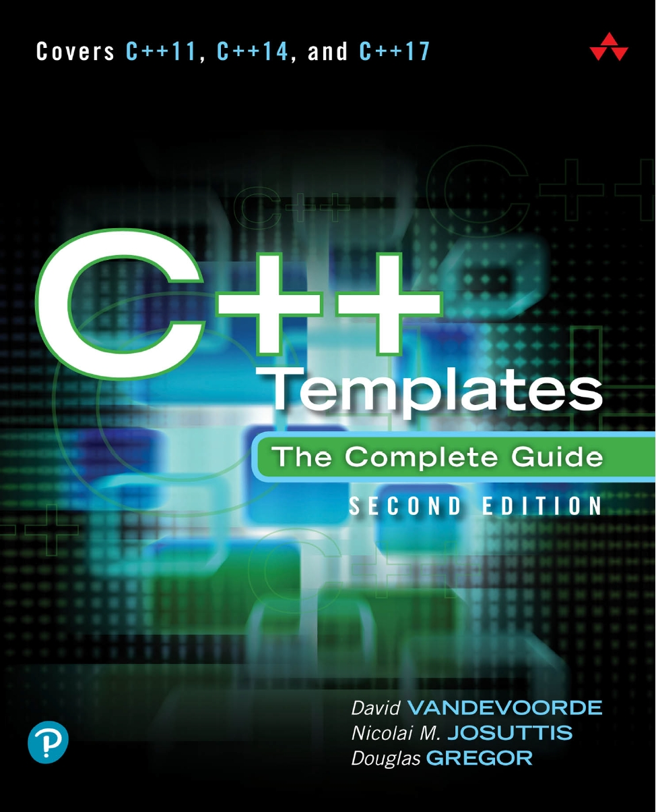

# CXXTemplates —— C++ 模板

*C++ Templates Learning, Documenting and Coding.*

## 目录

+ [0. 简介](./Chapters/ch0.md)
+ [Part 1](./Chapters/Part1/README.md)
  + [1. 函数模板](./Chapters/Part1/ch1.md)
  + [2. 类模板](./Chapters/Part1/ch2.md)
  + [3. 非类型模板参数](./Chapters/Part1/ch3.md)
  + [4. 可变参数模板](./Chapters/Part1/ch4.md)
  + [5. 模板基础进阶](./Chapters/Part1/ch5.md)
  + [6. 移动语法和 `enable_if<>`](./Chapters/Part1/ch6.md)
  + [7. 通过值还是引用](./Chapters/Part1/ch7.md)
+ Part 2
+ Part 3
+ Appendix
  + [Appendix A. 唯一定义规则](./Chapters/Appendix/A.md)
  + [Appendix B. 值类别](./Chapters/Appendix/B.md)